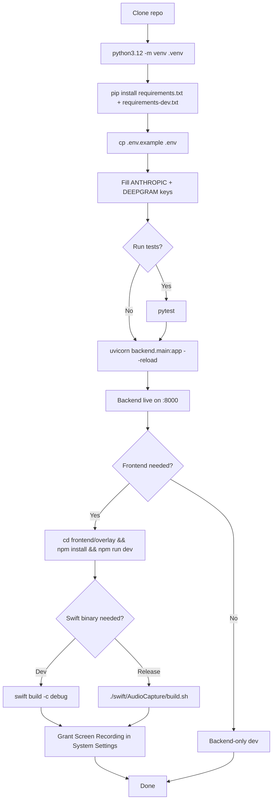

# First-Time Setup (host Python venv)

## 1. Clone and create the venv

```bash
git clone <repo-url> persuasion-dojo
cd persuasion-dojo
python3.12 -m venv .venv
source .venv/bin/activate
pip install --upgrade pip
```

## 2. Install dependencies

Core runtime + dev tools (required to run the test suite):

```bash
pip install -r requirements.txt -r requirements-dev.txt
```

> The dev dependencies were split out of `requirements.txt` so the Docker image stays small — see [[Docker Deployment]]. Host venv users must install both.

Optional — voiceprint extras (adds `torch` + `wespeakerruntime`, large download):

```bash
pip install -r requirements-voiceprint.txt
```

Voiceprint tests are deselected by default in `pyproject.toml` (`addopts = ["-m", "not voiceprint"]`); CI installs them unconditionally.

## 3. Configure environment

```bash
cp .env.example .env
# Edit .env and fill in ANTHROPIC_API_KEY + DEEPGRAM_API_KEY
```

See [[Environment Variables]] for every knob.

## 4. Run the tests

```bash
pytest                         # ~1,500 tests, voiceprint deselected
pytest --cov=backend           # with coverage
pytest -m eval                 # LLM evals — requires live API key
```

See [[Python Tests]] for markers, CI behaviour, and how to add a new eval.

## 5. Setup flow (mermaid)



## Next

→ [[Running the Backend]]
→ [[Running the Frontend Overlay]]
→ [[Running the Swift Binary]]
