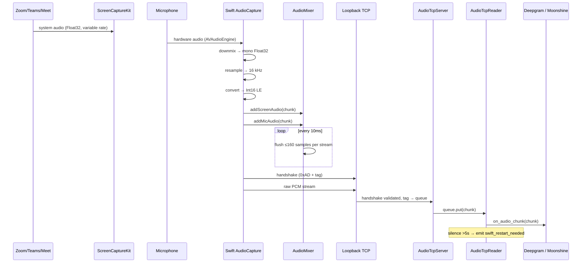

# Audio Pipeline

## Sequence diagram

## Stages

1. **Capture** — `SCShareableContent` gives system audio; `AVAudioEngine` taps the mic.
2. **Normalize** — the Swift binary downmixes multi-channel Float32 to mono, resamples to 16 kHz, and converts to Int16 LE. See [[AudioCapture Binary]].
3. **Mix & rate-control** — per-stream buffers in `AudioMixer`, flushed every 10 ms with a 1× realtime budget (~32 KB/s per stream).
4. **Transport** — two TCP connections (system tag `0x01`, mic tag `0x02`) to `127.0.0.1:AUDIO_TCP_PORT`. No length prefix — raw PCM after the 2-byte handshake. See [[TCP Transport]].
5. **Ingest** — the [[Backend - audio_tcp_server|AudioTcpServer]] validates the handshake, routes bytes to a per-tag `asyncio.Queue`, and parks connections for up to 30s if no reader is registered yet.
6. **Read** — the [[Backend - audio|AudioTcpReader]] drains the queue, forwards to `on_audio_chunk(chunk)`, and runs a [[Audio Lifecycle and Supervision|silence watchdog]].
7. **Transcription** — see [[Transcription Pipeline]].

## Why TCP instead of named pipes

Named pipes couple the Swift binary to the host filesystem, which breaks when the backend runs in Docker. Switching to loopback TCP means the host Swift can target either a host-native or a container-hosted backend transparently — the Docker compose file publishes `127.0.0.1:9090:9090`. Full rationale in `docs/superpowers/specs/2026-04-19-audio-tcp-transport-design.md` and the [[Design Docs Index]].

## Two parallel transcribers

The system audio stream has **diarization ON** (speaker labels `counterpart_0`, `counterpart_1`, …). The mic stream has diarization OFF — all utterances are labeled `user`.

An **echo filter** in the session pipeline suppresses system-side utterances whose word-set overlaps ≥60% with the last 10 mic utterances, preventing your own voice from being counted twice.

## Reference

- Source: `swift/AudioCapture/Sources/AudioCaptureCore/*`, `backend/audio.py`, `backend/audio_tcp_server.py`.
- Tests: `tests/test_audio*.py` — see [[Python Tests]].
- Spec: `docs/superpowers/specs/2026-04-19-audio-tcp-transport-design.md`.
