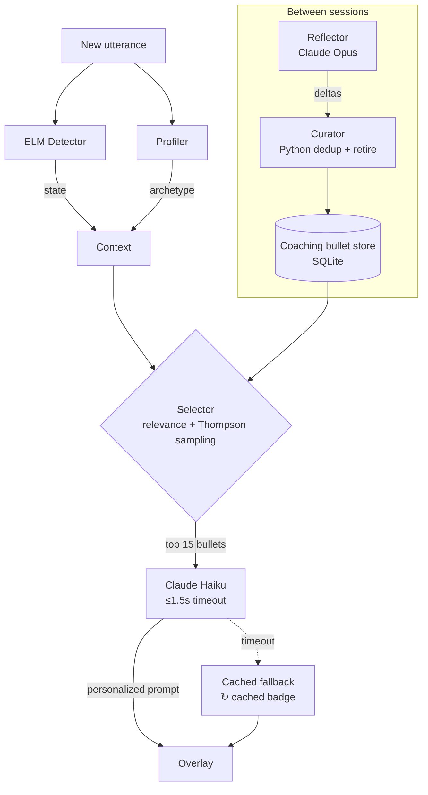

# Coaching Engine Architecture

## The select + personalize loop

## Three roles (the [[ACE Loop]])

1. **Reflector** — Claude Opus, runs post-session. Reads the full transcript + what prompts fired and extracts up to 8 structured lessons ("when this user meets an Inquisitor in a board context, leading with a statistic worked").
2. **Curator** — pure Python. Merges deltas into the SQLite `CoachingBullet` table. Dedup by content hash. Retires bullets where `harmful ≥ helpful + margin`.
3. **Selector** — pure Python (<10 ms). Scores active bullets for relevance given the current ELM state + archetype pairing + layer. Uses Thompson sampling for explore/exploit.

## Three layers fire simultaneously

See [[Coaching Layers]] — Self, Audience, Group each get their own selector pass. The overlay renders the highest-priority layer at full size; the other two collapse to single-word labels.

## Cadence

- **ELM-triggered:** 10 s minimum floor, counterpart utterances only.
- **General (self / group):** 15 s floor, fires on both speakers.
- **Suppression:** prompts suppressed while the user is mid-utterance; resume 500 ms after last `is_final`.

Full rules in [[Cadence Rules]].

## Haiku timeout + fallback

- Haiku call budget: 1.5 s.
- On timeout, the engine returns the last cached prompt with `is_fallback=True` and the overlay shows a `↻ cached` badge.
- If no prompt has been cached yet, the engine silently skips — better no prompt than a stale one.

## Legacy playbook path

Before the bullet store existed, [[Backend - coaching_memory|coaching_memory.py]] had Opus rewrite a monolithic markdown playbook between sessions. It's still wired up as a last-resort fallback when the bullet store is empty. New code should target the bullet store exclusively.

## Reference

- Source: `backend/coaching_engine.py`, `backend/coaching_bullets.py`, `backend/seed_tips.py`, `backend/coaching_memory.py`.
- Seed data: `data/seed_tips.json` (132 pre-written tips, loaded on startup via `seed_tips.py`).
- Tests: `tests/test_coaching_engine.py`, `tests/test_coaching_bullets.py`, `tests/test_coaching_quality.py`, `tests/test_ace_convergence.py`.
- Evals: `tests/evals/coaching_prompts.py`.
