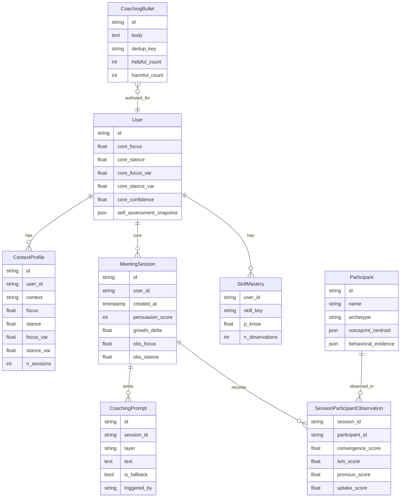

# Data Model

All tables live in SQLite (WAL mode, async via aiosqlite). Schema defined in [[Backend - models|models.py]].

## Entity-relationship (mermaid)

## Three-layer user profile

| layer | scope | update rule |
|-------|-------|-------------|
| **1 — Core** | `User.core_focus`, `User.core_stance` | EWMA over all sessions |
| **2 — Context** | `ContextProfile.focus` / `.stance` | EWMA per (user, context), once ≥3 sessions in that context |
| **3 — Session** | `MeetingSession.obs_focus` / `.obs_stance` | raw behavioural observation for this session only |

Confidence grows exponentially from 0.35 (prior dominant) to 0.95 (behaviour dominant) over ~15 sessions.

## Key invariants

- All profile updates go through `apply_session_observation()` in [[Backend - models|models.py]].
- `get_profile_snapshot()` returns the effective archetype for coaching based on the most trusted layer.
- Welford's M2 algorithm accumulates variance online (no need to store all session points).
- [[Backend - coaching_bullets|CoachingBullet]] rows are append-only; retirement is a flag, not a delete.
- Participant records are created only by the [[Backend - identity|identity resolver]] — guarded against technical terms becoming names.

## Migrations

`init_db()` runs on FastAPI startup and auto-adds new columns. There is no Alembic — schema evolution is code-driven and column-additive only.

## Reference

- Source: `backend/models.py`, `backend/database.py`.
- Tests: `tests/test_models.py`, `tests/test_database.py`, `tests/test_profile_benchmark.py`.
- Design background: `docs/designs/situational-flexibility-architecture.md`.
