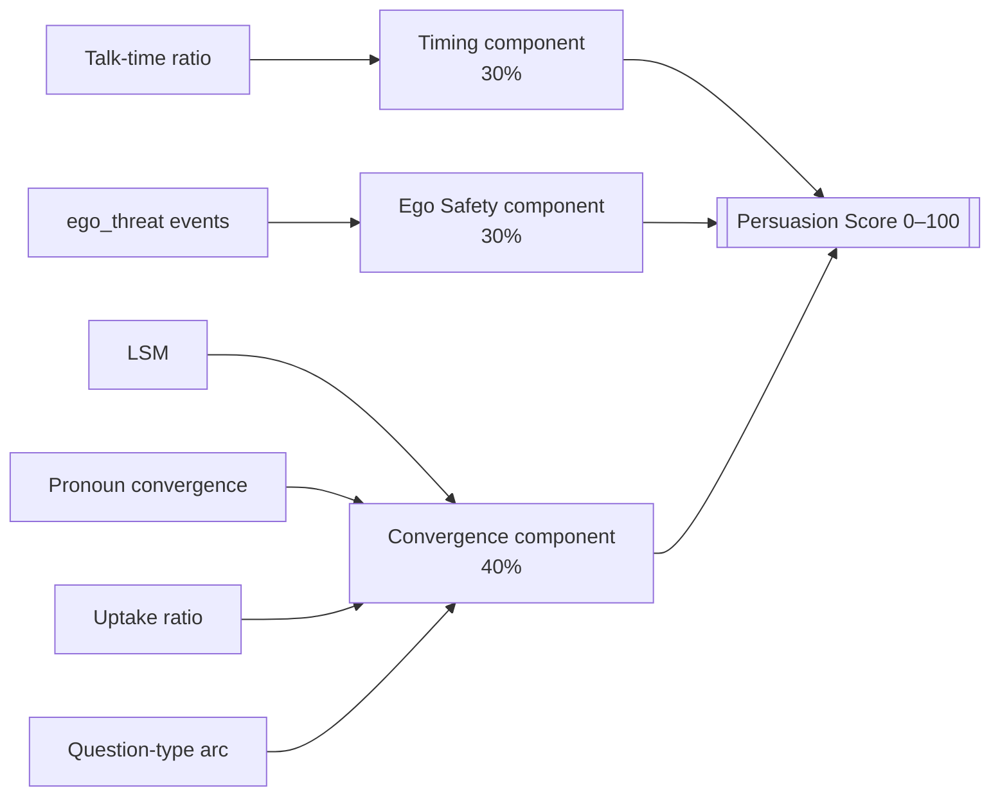

# Scoring Engine

All scoring logic is **pure functions** in [[Backend - scoring|scoring.py]] — no I/O, no database access. The session pipeline calls them with the in-memory session state and persists the result.

## Persuasion Score (0–100)

- **Timing (30%)** — talk-time ratio; sweet spot 25–45% user speaking.
- **Ego Safety (30%)** — derived from [[ELM State Detection|ego_threat event count]].
- **Convergence (40%)** — weighted composite of four validated NLP signals (see [[Backend - signals]]): LSM 35%, pronoun convergence 25%, uptake 25%, question-type arc 15%.

**Disclosure:** weights are calibrated by user feedback over time, not empirically derived. The overlay must surface this when showing the score.

## Growth Score

Delta of the current Persuasion Score vs. the user's rolling EWMA baseline. `None` until ≥2 sessions exist.

## Flexibility Score

Distribution-based adaptation measure — see [[Flexibility Score and CAPS]]. Gated on ≥2 qualified contexts with ≥3 sessions each.

## CAPS signatures

If-then mappings of context → archetype (Mischel & Shoda). E.g., "you're more Logic-dominant in board settings."

## Skill badges & BKT

5 coaching skills tracked per user via [[Bayesian Knowledge Tracing]]:

| skill key | what it measures |
|-----------|------------------|
| `elm:ego_threat` | managing defensive reactions |
| `elm:shortcut` | detecting surface agreement |
| `pairing:archetype_match` | adapting to counterpart's style |
| `timing:talk_ratio` | maintaining 25–45% balance |
| `convergence:uptake` | building on contributions |

## Reference

- Source: `backend/scoring.py`, `backend/signals.py`.
- Tests: `tests/test_scoring.py`, `tests/test_signals.py`, `tests/test_bkt.py`.
- Validation spike: `scripts/convergence_spike.py` — required ≥75% signal agreement before this module was written.
