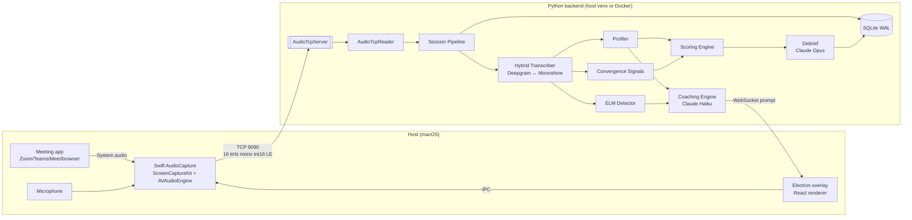

# System Overview

Persuasion Dojo is a macOS desktop app that listens to a live meeting, transcribes it, and surfaces private coaching prompts in a floating overlay beside Zoom / Teams / Meet / Webex / browser-based calls.

## End-to-end flowchart

## The six functional layers

1. **Transport** — [[Backend - audio|audio.py]], [[Backend - audio_tcp_server|audio_tcp_server.py]], [[Backend - transcription|transcription.py]]. Raw PCM → utterances.
2. **Identity** — [[Backend - identity|identity.py]], [[Backend - speaker_resolver|speaker_resolver.py]], [[Backend - turn_tracker|turn_tracker.py]], [[Backend - speaker_embeddings|speaker_embeddings.py]]. Who said what.
3. **Behavior** — [[Backend - profiler|profiler.py]], [[Backend - elm_detector|elm_detector.py]], [[Backend - signals|signals.py]]. What do the utterances mean.
4. **Profile** — [[Backend - models|models.py]], [[Backend - self_assessment|self_assessment.py]], [[Backend - pre_seeding|pre_seeding.py]]. User / counterpart archetypes.
5. **Coaching** — [[Backend - coaching_engine|coaching_engine.py]], [[Backend - coaching_bullets|coaching_bullets.py]], [[Backend - scoring|scoring.py]]. Real-time guidance + post-session scoring.
6. **Orchestration** — [[Backend - main|main.py]], [[Backend - database|database.py]], [[Backend - calendar_service|calendar_service.py]]. HTTP/WS API + lifecycle.

## Three-layer user profile

The [[Data Model]] maintains archetype estimates at three time scales:

| Layer | Scope | Update rule |
|-------|-------|-------------|
| 1 — Core | all sessions | EWMA of focus/stance axes across 100+ sessions |
| 2 — Context | per (board / team / 1:1 / client) | EWMA per context once ≥3 sessions exist |
| 3 — Session | single session | raw behavioural observation |

Confidence grows from 0.35 (prior dominant) to 0.95 (behaviour dominant) over ~15 sessions.

## Key runtime concepts

- **[[Communicator Superpowers]]** — two axes, four archetypes: Architect, Firestarter, Inquisitor, Bridge Builder.
- **[[Coaching Layers]]** — three layers (Self / Audience / Group) fire simultaneously; overlay surfaces the highest priority.
- **[[ELM State Detection]]** — ego_threat, shortcut, consensus_protection, neutral. Drives urgent prompts with a 10s floor.
- **[[Cadence Rules]]** — ELM-triggered: 10s floor (counterpart utterances only); general: 15s floor (both speakers).
- **[[ACE Loop]]** — Selector / Curator / Reflector self-improving coaching bullet store (Opus rewrites between sessions, Haiku personalizes live).
- **[[Persuasion Score]]** — 0–100, weighted Timing 30% / Ego Safety 30% / Convergence 40%.
- **[[Flexibility Score and CAPS]]** — distribution-based archetype adaptation across contexts.
- **[[Bayesian Knowledge Tracing]]** — per-skill mastery tracking (5 skills).

## Resilience

- Hybrid transcription — Deepgram (cloud) with Moonshine (local) failover. Ring buffer replays 5s of context on failover.
- Silence watchdog — [[Audio Lifecycle and Supervision|5s of no audio]] triggers a Swift binary restart via WebSocket + IPC.
- Haiku fallback — 1.5s timeout; stale prompts marked `↻ cached` in the overlay.

## Privacy posture

- All participant profiles live in local SQLite — nothing leaves the device except transcript text sent to Claude / Deepgram.
- [[Backend - team_sync|Team Intelligence]] exports are AES-256-GCM encrypted; passphrase required to import.
- [[First-Run Wizard]] discloses exactly what leaves the machine.
