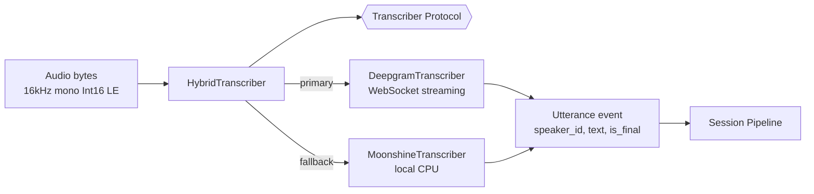

# Transcription Pipeline

## Components

All transcribers implement the [[Backend - transcriber_protocol|Transcriber protocol]] so they're drop-in replaceable.

## Deepgram streaming (primary)

- WebSocket connection to Deepgram `listen` endpoint.
- Model: `nova-3` (upgraded from `nova-2` in v0.10.2.0).
- System stream: `diarize=true` — returns `speaker` labels.
- Mic stream: `diarize=false` — all utterances labeled `user`.
- Pre-session health check (`deepgram_health_check()`) before connecting to catch API outages early.
- Ring buffer (~5s) stores recent audio so failover to Moonshine can replay context.

## Moonshine (local fallback)

- Moonshine v2 streaming ASR, CPU-only.
- Lazy-loaded on first use (avoids import cost when Deepgram is healthy).
- Converts 16-bit LE PCM → Float32 before inference.
- No diarization — used as a safety net, not a primary.

## HybridTranscriber

Orchestrator modes:
- `cloud` — Deepgram only.
- `local` — Moonshine only.
- `auto` — Deepgram first; fall back to Moonshine on error (current default).

On failover, the ring buffer replays so no utterance is lost. The overlay receives a `transcriber_status` WebSocket message and shows whether cloud or local is active.

## Latency target

- <500 ms from Deepgram `is_final` → coaching trigger.
- <2 s total speech → overlay prompt display.

## Reference

- Source: `backend/transcription.py`, `backend/moonshine_transcription.py`, `backend/hybrid_transcription.py`, `backend/transcriber_protocol.py`.
- Tests: `tests/test_transcription.py`, `tests/test_moonshine_transcription.py`, `tests/test_hybrid_transcription.py`.
- Fixtures: `deepgram_emulator` (session-scoped local server) in `tests/conftest.py`.
