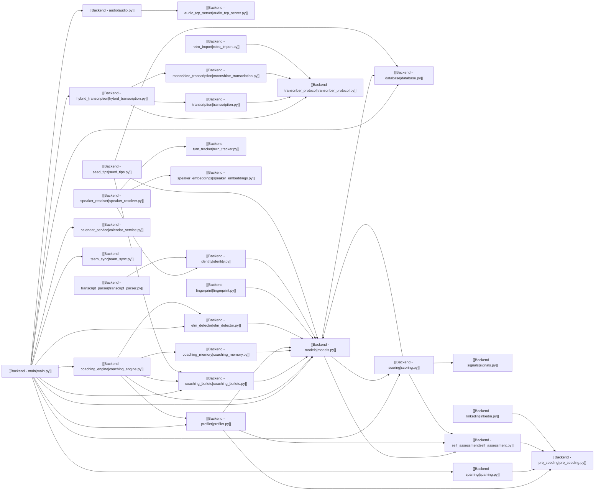

# Backend Module Graph

Every edge below is a real Python `import`. Obsidian Graph view reproduces this automatically from the `[[wikilinks]]` on each module note.

## Most central modules

Ranked by total in-degree + out-degree:

1. **[[Backend - models|models.py]]** — imported by 12+ modules. The ORM + data layer is the hub.
2. **[[Backend - main|main.py]]** — imports 13+ modules. Orchestrates every session.
3. **[[Backend - coaching_engine|coaching_engine.py]]** — imports 5, imported by main. Decision-maker.
4. **[[Backend - profiler|profiler.py]]** — imports 3, imported by 2. Behavioural signal source.
5. **[[Backend - scoring|scoring.py]]** — imports 3, imported by 2. Pure-function scoring layer.
6. **[[Backend - self_assessment|self_assessment.py]]** — imported by 5. Archetype mapping.
7. **[[Backend - transcriber_protocol|transcriber_protocol.py]]** — imported by 3 transcribers. Interface.

## Layer grouping

- **Transport** — audio, audio_tcp_server, transcription, moonshine_transcription, hybrid_transcription, transcriber_protocol.
- **Identity** — identity, speaker_resolver, turn_tracker, speaker_embeddings.
- **Behavior** — profiler, elm_detector, signals.
- **Profile** — models, self_assessment, pre_seeding, fingerprint.
- **Coaching** — coaching_engine, coaching_bullets, coaching_memory, scoring, seed_tips.
- **Orchestration** — main, database, calendar_service, team_sync, sparring, retro_import, transcript_parser, linkedin.
