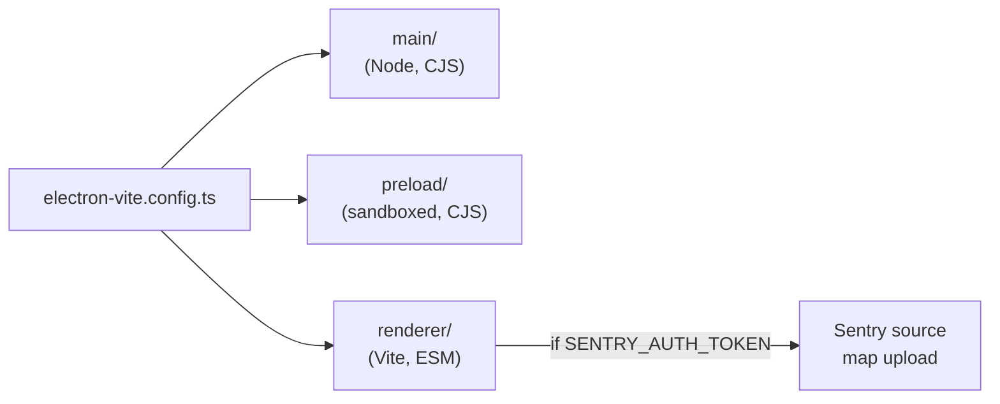

# Build and Package

## `electron-builder.json`

- `appId`: `com.persuasiondojo.overlay`.
- `extraResources`: bundles
  `swift/AudioCapture/.build/release/AudioCapture` →
  `bin/AudioCapture` inside the `.app` so the main process can spawn
  it directly. See [[AudioCapture Binary]].
- `afterSign`: `notarize.cjs` (see below).
- `mac.entitlements`:
  - hardened runtime on,
  - `NSMicrophoneUsageDescription`,
  - `NSScreenCaptureUsageDescription` / screen-capture entitlement.
- `mac.target`: `dmg`, `arm64` + `x64` (universal not used — two DMGs).
- `publish.provider`: `github` (release artifacts pushed to GitHub
  Releases by the [[Release Pipeline]]).

## `electron-vite.config.ts`

Three build targets compiled in one pass:



If `SENTRY_AUTH_TOKEN` is set at build time, the renderer build runs
the Sentry Vite plugin and uploads source maps for the release.

## `notarize.cjs`

- Runs in `afterSign`.
- Calls `@electron/notarize` → `xcrun notarytool`.
- Reads `APPLE_ID`, `APPLE_APP_SPECIFIC_PASSWORD`, `APPLE_TEAM_ID`.
- **No-op when `APPLE_ID` is absent** so local dev builds don't fail
  on machines without the signing credentials.

## Sentry integration

- Main process: `@sentry/electron/main` initialized in `src/main/index.ts`.
- Renderer: `@sentry/react` initialized in `src/renderer/src/main.tsx`.
- DSN is injected at build time via a Vite `define` so the renderer
  bundle ships with the correct project key.
- Source maps: uploaded only when `SENTRY_AUTH_TOKEN` is present, so
  CI gets full symbolication and local builds stay hermetic.

## Commands

```bash
cd frontend/overlay
npm install
npm run dev           # electron-vite dev server + hot reload
npm run build         # type check + build all three targets
npm run build:mac     # electron-builder → DMG (arm64 + x64)
```

## Related

- [[Release Pipeline]] — the GitHub Actions workflow that ships DMGs.
- [[Frontend Overview]] — where this artifact fits in the system.
