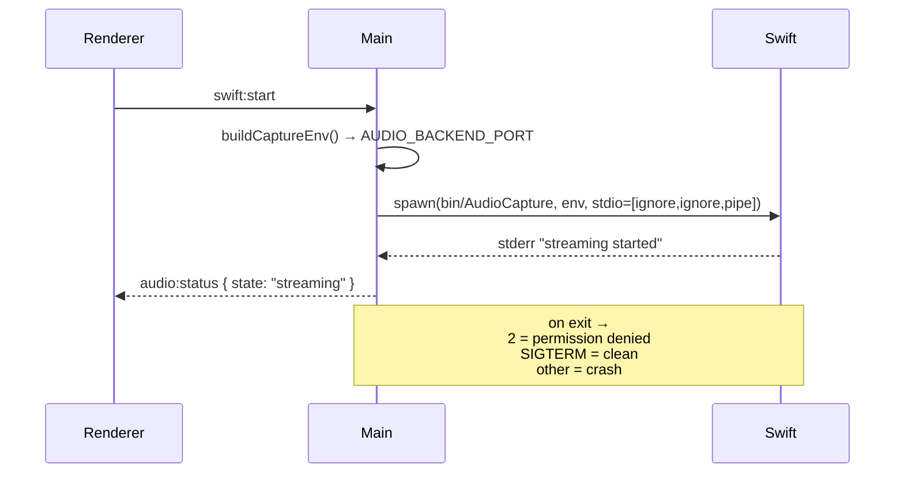

# Electron Main Process

Source: `frontend/overlay/src/main/index.ts` (~457 lines).

## Responsibilities

- Persistent window preferences (position + size).
- Sentry initialization in the main process (`@sentry/electron/main`).
- Swift binary spawn / restart / stop, plus supervision of its exit codes.
- Overlay window creation and styling (see spec below).
- Global hotkey registration — works even when Zoom / Teams has focus.
  Details in [[Frontend Hotkeys]].
- App lifecycle (`ready`, `window-all-closed`, `before-quit`).
- IPC handlers exposed to the [[React Renderer]] via the preload bridge.

## IPC channels

| Channel | Direction | Purpose |
| --- | --- | --- |
| `swift:start` | renderer → main | Spawn the AudioCapture binary. |
| `swift:restart` | renderer → main | Kill + respawn (silence watchdog). |
| `swift:stop` | renderer → main | SIGTERM the child, clean shutdown. |
| `audio:status` | main → renderer | Streaming / crashed / denied events. |
| `audio:is-running` | renderer → main | Synchronous child-alive check. |
| `overlay:minimize` | renderer → main | `win.hide()`. |
| `shell:open-external` | renderer → main | Open URLs in default browser. |
| `context-menu:show` | renderer → main | Native right-click menu. |

## Window spec

- Size: `480 x 720` (min `420 x 600`, max `600 x ...`).
- `alwaysOnTop: true`, `level: "floating"`,
  `visibleOnAllWorkspaces: true`.
- `titleBarStyle: "hiddenInset"`, frameless.
- `backgroundColor: "#1A1A1E"` (per `DESIGN.md`).
- On blur → opacity `0.75` (Raycast-style unfocused dim).
- Window position is persisted in
  `~/.config/Persuasion Dojo/window-prefs.json` and restored on launch.

## Swift binary spawn

- `stdio = [ignore, ignore, pipe]` — only stderr is captured for logs.
- Env is resolved via `capture-env.ts::buildCaptureEnv()`, which reads
  `AUDIO_TCP_PORT` / `AUDIO_BACKEND_PORT` and treats empty strings as
  unset (see commit `ded175d`).
- Exit-code taxonomy:
  - `2` — Screen Recording permission denied → renderer shows the
    permission nudge and can call `openScreenRecording()`.
  - `SIGTERM` — clean shutdown initiated by main.
  - Any other non-zero → crash; [[Audio Lifecycle and Supervision]]
    handles respawn via the silence watchdog.

## Related

- [[AudioCapture Binary]] — what the child actually does.
- [[React Renderer]] — consumer of these IPC channels.
- [[Frontend Hotkeys]] — global shortcut registrations.
