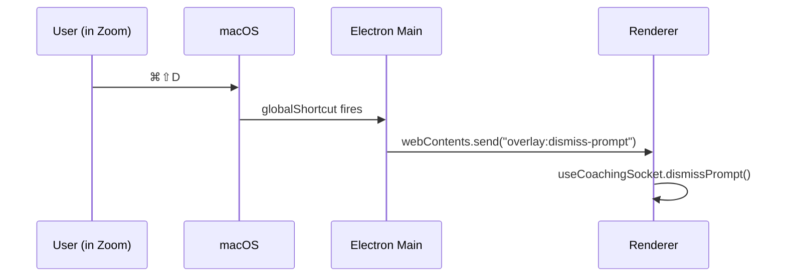

# Frontend Hotkeys

All shortcuts are registered via `electron.globalShortcut` in
[[Electron Main Process]] so they fire even when the Zoom, Teams, or
browser meeting window holds keyboard focus. The main process relays
each event to the renderer over IPC.

## Default bindings

| Hotkey | Action | IPC channel |
| --- | --- | --- |
| `⌘⇧D` | Dismiss current prompt | `overlay:dismiss-prompt` |
| `⌘⇧L` | Cycle layer (Audience → Self → Group) | `overlay:cycle-layer` |
| `⌘⇧H` | Toggle history tray | `overlay:toggle-history` |
| `⌘⇧M` | Minimize overlay | `win.hide()` (main-local) |

`⌘⇧M` is handled entirely in the main process (it just calls
`win.hide()`); the other three are forwarded to the renderer via
`window.api.onHotkey(cb)`.

## Flow

## User customization

The `SettingsPane` (see [[React Renderer]]) lets the user rebind every
shortcut. On save, the renderer sends the new bindings to main, which
calls `globalShortcut.unregisterAll()` and re-registers the updated
set. Persisted in the same user-prefs file as window geometry.

## Layer cycle

`⌘⇧L` advances through the three coaching layers that fire
simultaneously in the engine (see [[Coaching Layers]]):

1. **Audience** — who is this participant and what do they need?
2. **Self** — is the user in the right mode for this moment?
3. **Group** — when to push, yield, or invite contribution?

The overlay pins the selected layer so the user can focus their
attention, without changing what the coaching engine produces.

## Related

- [[Electron Main Process]] — registers the shortcuts.
- [[Coaching Layers]] — semantics of the three layers.
