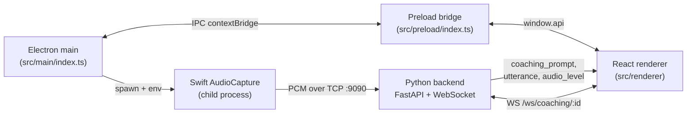

# Frontend Overview

The overlay is a floating, always-on-top coaching UI. It is the only thing
the user sees during a meeting — a compact panel that surfaces private
text prompts generated by the coaching engine while Zoom / Teams / Meet
has focus.

## Responsibilities

- Spawn and supervise the [[AudioCapture Binary]] on the host.
- Open a WebSocket to the Python backend (see [[WebSocket Hooks]]) and
  render incoming coaching prompts, transcripts, and audio levels.
- Forward `AUDIO_BACKEND_PORT` (derived from `AUDIO_TCP_PORT` /
  `AUDIO_BACKEND_PORT` env) to the Swift child process so it knows
  where to dial the backend listener.
- Register global hotkeys so the user can dismiss, cycle layers, toggle
  history and minimize without stealing focus from the meeting app.
- Persist window geometry and user preferences across restarts.

## Process topology

## File layout (high level)

- `frontend/overlay/src/main/` — Electron main: window, hotkeys, Swift
  supervision, Sentry init. See [[Electron Main Process]].
- `frontend/overlay/src/preload/` — context-isolated bridge exposing
  `window.api`.
- `frontend/overlay/src/renderer/` — React UI. See [[React Renderer]].
- `frontend/overlay/electron-builder.json`,
  `frontend/overlay/electron-vite.config.ts`,
  `frontend/overlay/notarize.cjs` — packaging. See [[Build and Package]].

## How it connects

1. User launches the overlay (dev: `npm run dev`; prod: DMG).
2. Main opens the window, loads the renderer, and waits for
   `startCapture` from the renderer.
3. Renderer calls `window.api.startCapture()` which spawns the Swift
   binary. See [[Audio Lifecycle and Supervision]].
4. Swift dials `127.0.0.1:AUDIO_BACKEND_PORT` and streams PCM.
5. Renderer opens a WebSocket to the backend, which has already started
   an audio TCP listener in its FastAPI lifespan.

## Related

- [[AudioCapture Binary]] — the Swift child process.
- [[TCP Transport]] — wire format between Swift and backend.
- [[Running the Frontend Overlay]] — local dev instructions.
