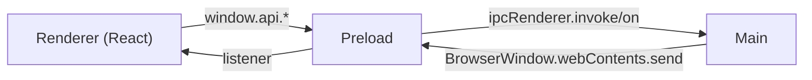

# React Renderer

Source: `frontend/overlay/src/renderer/src/`.

## Entry and shell

- `main.tsx` — renderer entry. Initializes `@sentry/react` (DSN injected
  at build time), mounts `<App />`.
- `App.tsx` — top-level `ErrorBoundary` + routing shell.
- `Overlay.tsx` — tab container and session state owner (~1500 lines).
  Coordinates hooks, wires `window.api` events to UI state, and owns
  the audio/session start+stop flow.

## Components (`components/`)

All panes are stateless / hook-driven — logic lives in `Overlay.tsx`
and the hooks under `hooks/`.

| Component | Purpose |
| --- | --- |
| `CalendarPane` | Google Calendar connect + next-meeting view. |
| `ConnectionStatus` | WS state, transcriber backend, audio level. |
| `HistoryTray` | Past prompts within the current session. |
| `OnboardingWizard` | First-run disclosure + permissions. |
| `PreSeedPane` | Paste-text pre-meeting classification. |
| `ProfilesPane` | Participant Superpower profiles. |
| `RetroImportPane` | Upload transcripts for post-hoc analysis. |
| `SettingsPane` | API keys, hotkeys, privacy toggles. |
| `SkillBadgesPane` | BKT-derived skill mastery badges. |
| `SparringPane` | Text-only AI sparring partner UI. |
| `TeamSyncPane` | AES-256 encrypted team JSON export / import. |
| `TranscriptPane` | Live rolling transcript (50 utterances). |

## Styles

`styles/` follows `DESIGN.md`: background `#1A1A1E`, gold accent
`#D4A853`, Playfair Display / DM Sans / JetBrains Mono.

## Preload bridge

Source: `frontend/overlay/src/preload/index.ts`. Context isolation is
enabled; the renderer only sees the API surface exposed via
`contextBridge.exposeInMainWorld("api", ...)`.

`window.api` surface:

- `getVersion()` — app version string.
- `onHotkey(cb)` — subscribe to hotkey events from the main process.
- `startCapture()` / `restartCapture()` / `stopCapture()` — Swift
  child lifecycle. See [[Electron Main Process]].
- `isAudioRunning()` — synchronous child-alive check.
- `onAudioStatus(cb)` — stream of `audio:status` events.
- `minimize()` — hide the overlay window.
- `openScreenRecording()` — opens System Settings to the Screen
  Recording pane when permission has been denied.

## Related

- [[WebSocket Hooks]] — how the renderer talks to the backend.
- [[Electron Main Process]] — what the IPC calls actually do.
