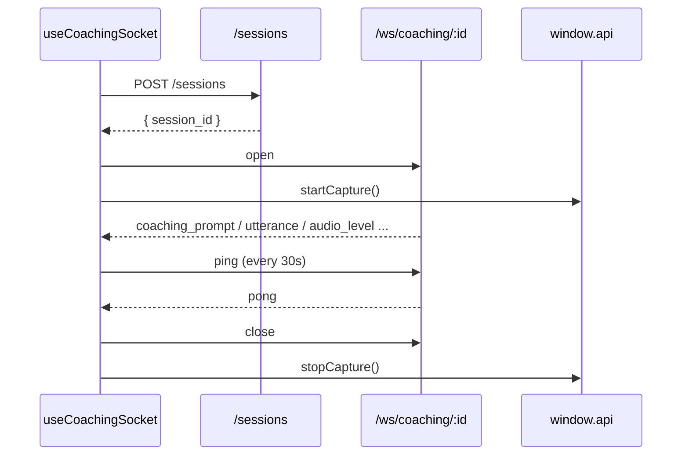

# WebSocket Hooks

Source: `frontend/overlay/src/renderer/src/hooks/`.

## `useCoachingSocket.ts` (~420 lines)

Owns the primary session loop: REST to create a session, WS to stream
coaching, IPC to start audio capture.

### State

- `sessionId`
- `connectionState`: `"idle" | "connecting" | "connected" |
  "reconnecting" | "error"`
- `sessionPhase`: intro / active / wrap-up signal for the UI.
- `prompts` — ring buffer, max 5.
- `currentPrompt` — the one the user is seeing.
- `sessionResult` — summary + Persuasion Score on session end.
- `audioLevel` — normalized 0..1 for the mic indicator.
- `transcripts` — rolling 50 utterances.
- `speakerNames` — resolved names from [[speaker_resolver]].
- `detectedProfiles` — Superpower classifications from `profiler.py`.
- `transcriptionBackend`: `"cloud" | "local" | null`.

### Actions

- `startSession()` — `POST /sessions` → open WS → call
  `window.api.startCapture()`.
- `endSession()` — close WS, `stopCapture`, flush result.
- `dismissPrompt()` — remove current prompt, advance queue.
- `clearError()` / `resetSession()` — recovery paths.
- `confirmProfile(participantId, superpower)` — user correction.
- `sendFeedback(promptId, verdict)` — 👍 / 👎 for bullet store.

### Messages received

| Type | Effect |
| --- | --- |
| `coaching_prompt` | Push into `prompts`, set `currentPrompt`. |
| `utterance` | Append to `transcripts`. |
| `audio_level` | Update `audioLevel`. |
| `speaker_identified` | Merge into `speakerNames`. |
| `profile_detected` | Merge into `detectedProfiles`. |
| `transcriber_status` | Update `transcriptionBackend` badge. |
| `swift_restart_needed` | Call `window.api.restartCapture()`. |
| `session_ended` | Populate `sessionResult`, close. |
| `error` | Move to `"error"` state. |

30s keepalive `ping` / `pong` keeps the socket warm through NAT /
idle timeouts.

## `useSparringSocket.ts`

Same shape for `/ws/sparring/{id}` — the text-only AI opponent mode.

- Client sends `user_turn` messages.
- Server streams `opponent_turn` tokens back, then emits one
  `coaching_tip` per exchange.
- Target latency `<3s` total round-trip.

## Related

- [[Coaching Engine Architecture]] — producer of the messages above.
- [[Running the Backend]] — how to start the server these hooks talk to.
