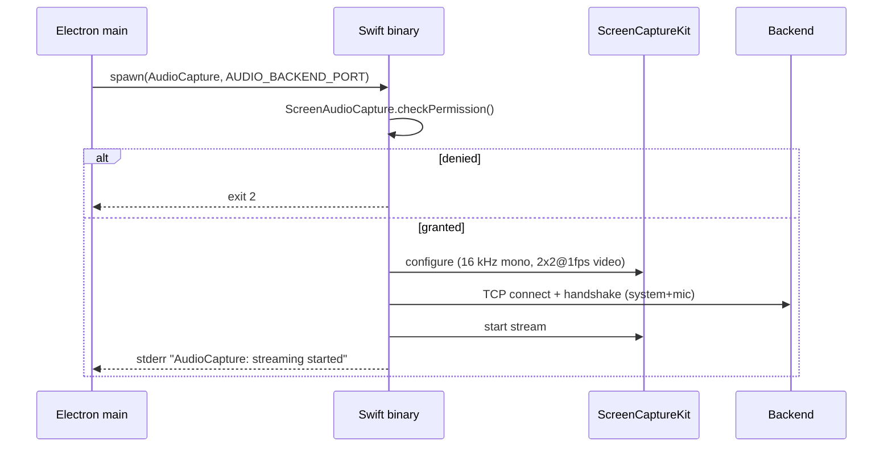
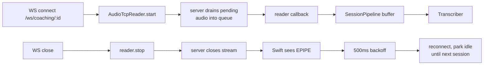

# Audio Lifecycle and Supervision

Three processes cooperate: the Swift [[AudioCapture Binary]], the
[[Electron Main Process]], and the Python backend
(see [[Backend - audio]]).

## Swift process lifecycle

Shutdown paths:

- **Graceful**: `SIGTERM` from Electron → `handleShutdown()` → stop
  SCK → close sockets → `exit(0)`.
- **Crash**: process dies → server sees broken connection →
  `AudioTcpReader` silence watchdog fires after **5 s** →
  `on_silence_timeout` callback emits WS `swift_restart_needed` →
  Electron respawns the binary. See [[Electron Main Process]].

## Python backend lifecycle

FastAPI `lifespan`:

1. `init_db()` (SQLite WAL, see [[Backend - database]]).
2. `AudioTcpServer(port).start()` binds the listener.
3. `yield` — app runs.
4. On shutdown: `AudioTcpServer.stop()` tears down the listener.

If the port is already in use, bind raises
`OSError(EADDRINUSE)` and the app aborts startup with a clear log —
usually means another container or stale process is holding `9090`.

## Session lifecycle

- The reader is per-session; the server is process-lifetime.
- Swift stays connected between sessions by design — the server
  simply stops draining frames when no reader is active.

## Silence watchdog

- Default **5 s**, configurable per reader.
- **Does not** fire before the first chunk arrives (avoids false
  positives during handshake / SCK warmup).
- Resets on every non-empty `recv`.
- Fires at most once per `start()` — guarded by a
  `_silence_fired` flag so a single outage produces a single
  `swift_restart_needed` event, not a storm.

## Related

- [[AudioCapture Binary]] — the supervised child.
- [[TCP Transport]] — the connection the watchdog observes.
- [[Backend - audio]] — `AudioTcpReader` implementation.
- [[Running the Swift Binary]] — local dev + manual testing.
