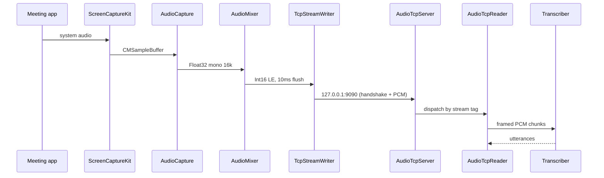

# AudioCapture Binary

Source: `swift/AudioCapture/` (Swift Package Manager).

## Targets

- `AudioCaptureCore` — library: mixer, writers, SCK/AVAudioEngine
  adapters, signal handling.
- `AudioCaptureCLI` — thin executable wrapping `Core` with env
  parsing and signal setup.
- `AudioCaptureTests` — SwiftPM tests.

Toolchain: Swift 5.9+, macOS 13+ (ScreenCaptureKit audio requires
macOS 12.3, build target is 13 for recent SCK APIs).

## Capture sources

1. **System audio** via `SCShareableContent` → `SCStream`
   (ScreenCaptureKit). Captures any meeting app — Zoom, Teams, Meet,
   Webex, browser — without per-app hooks.
2. **Microphone** via `AVAudioEngine.inputNode`.

## Normalization

Per source, in order:

1. Downmix multi-channel → mono `Float32`.
2. Resample → 16 kHz (linear interpolation — coaching latency matters
   more than audiophile quality).
3. Convert → `Int16` little-endian.

## `AudioMixer`

- Per-stream ring buffers (system + mic).
- `DispatchSourceTimer` flushes every **10 ms**.
- Up to **160 samples** per flush at 16 kHz (≈ 32 KB/s, 1× realtime).
- **1 s max** buffer trim prevents unbounded growth if the TCP writer
  stalls.

## Output: loopback TCP

- Destination: `127.0.0.1:AUDIO_BACKEND_PORT` (default `9090`).
- Handshake: 2 bytes — `0xAD` magic + stream tag
  (`0x01` system / `0x02` mic).
- Then: raw PCM, no length prefix, no framing.
- Full wire spec in [[TCP Transport]].

## `TcpStreamWriter`

- Runs on a `DispatchQueue(qos: .userInteractive)`.
- `SO_NOSIGPIPE` on the socket; process-wide `SIGPIPE` ignored.
- Reconnect backoff: **500 ms** on `EPIPE` / `ECONNREFUSED` /
  `ECONNRESET`.

## Environment

- `AUDIO_BACKEND_PORT` — defaults to `9090`. Must be a non-zero
  `UInt16`; invalid values cause an early exit with a clear log.

## Signals

- `SIGTERM` / `SIGINT` → graceful shutdown via `handleShutdown()`:
  stop SCK, drain mixer, close sockets, `exit(0)`.
- `SIGPIPE` → ignored (sockets use `SO_NOSIGPIPE`).

## Code signing

- Requires entitlement `com.apple.security.screen-capture`.
- `swift/AudioCapture/build.sh` codesigns the release binary with
  Developer ID Application and hardened runtime so it passes
  notarization when embedded in the Electron DMG.

## End-to-end pipeline

## Related

- [[TCP Transport]] — wire-level contract.
- [[Audio Lifecycle and Supervision]] — supervision + restart.
- [[Running the Swift Binary]] — local dev instructions.
