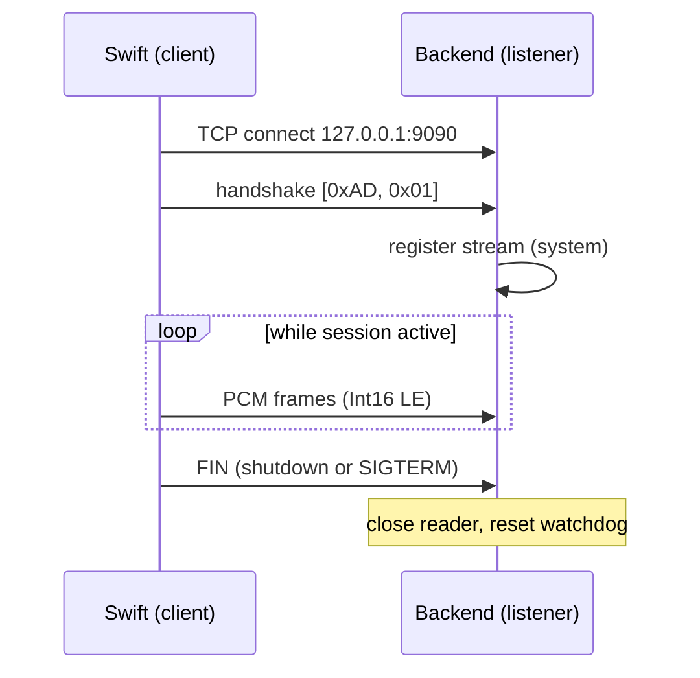

# TCP Transport

The host Swift binary ([[AudioCapture Binary]]) and the Python backend
communicate over a single loopback TCP connection per stream. This
replaced an earlier named-pipe design that could not work across the
Docker boundary.

## Wire protocol

1. **Handshake** (2 bytes, sent once per connection):
   - Byte 0: magic `0xAD`.
   - Byte 1: stream tag — `0x01` system audio, `0x02` microphone.
2. **Payload**: raw 16 kHz mono `Int16` little-endian PCM. **No length
   prefix, no framing.** Server reads in `recv(4096)` loops.

## Server-side validation

- Wrong magic byte → close immediately.
- Unknown stream tag → close.
- Truncated handshake (connection drops before 2 bytes) → close.
- Duplicate tag while an existing reader is active → close the
  **newer** connection so the in-flight stream is preserved.

## Close semantics

- Either side may send TCP `FIN` / `RST`.
- A zero-length `recv` on the server **does not** kill the session; it
  resets the silence watchdog so the reader can wait for a reconnect.
- Swift catches `EPIPE` on write and reconnects after **500 ms**
  backoff (see [[AudioCapture Binary]]).

## Why TCP, not FIFO

- Named pipes couple Swift to the host filesystem, which breaks when
  the backend runs inside Docker.
- Loopback TCP works transparently in both directions.
  `docker-compose.yml` publishes `127.0.0.1:9090:9090` so Swift on
  the host can dial the container. See [[Docker Deployment]].

## Topology: server listens, client dials

The backend container exposes the port and **listens**. The Swift
binary **dials**. This inversion matters:

- Swift can crash or be restarted by Electron without the backend
  needing to coordinate — it just waits for the next connect.
- The backend's lifespan owns the port, so there is exactly one
  listener regardless of how many audio streams come and go.

## Related

- [[AudioCapture Binary]] — the client side.
- [[Backend - audio_tcp_server]] — the listener.
- [[Backend - audio]] — the `AudioTcpReader` that consumes PCM.
- [[Audio Pipeline]] — where the decoded audio goes next.
- [[Docker Deployment]] — how the port is exposed to the host.
