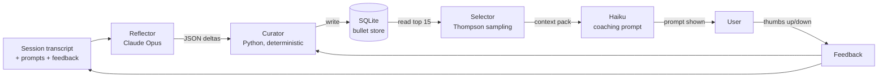

# ACE Loop

**Agentic Context Engineering** is the self-improving memory layer behind the coach. Instead of a fixed prompt, the Haiku prompt is assembled each tick from a living store of **coaching bullets** that is updated after every session and refined by user feedback.

## The three roles

1. **Reflector** — *Claude Opus, post-session, background.*
   Reads the full transcript + the prompts that fired + user feedback. Extracts up to **8 structured lessons** as JSON deltas: new bullets to add, existing bullets to reinforce, or bullets to flag as harmful.
2. **Curator** — *Python, deterministic, sync.*
   Applies Reflector deltas to the SQLite bullet store. Deduplicates by content hash. Retires a bullet when `harmful_count ≥ helpful_count + margin`. Never calls an LLM — all logic is rule-based and testable.
3. **Selector** — *Python, deterministic, <10 ms.*
   At each coaching tick, scores active bullets for relevance against the current context (archetype pairing, ELM state, layer). Uses **Thompson sampling** over helpful/harmful counters for explore/exploit balance. Picks the top **15 bullets** to inject into the Haiku prompt.

## The loop

## Bullet lifecycle

Each bullet in the store carries:

| Field | Purpose |
|---|---|
| `content_hash` | dedup key |
| `helpful_count` / `harmful_count` | user-feedback counters |
| `archetype_pair` | selector filter |
| `elm_state` | selector filter (optional) |
| `layer` | Self / Audience / Group |
| `created_at`, `last_used_at` | recency for Thompson prior |
| `retired_at` | set when harmful wins the margin |

## Why three roles, not one

Splitting the loop enforces discipline:

- The **LLM role (Reflector)** is the only one that sees prose — it never touches the database directly. This bounds its blast radius.
- The **deterministic roles (Curator, Selector)** are unit-testable — see `tests/test_ace_convergence.py` for the simulated multi-session convergence check.

See [[Backend - coaching_bullets]] for the schema and [[Backend - coaching_engine]] for how the selected bullets are folded into the live Haiku call. Skill-level mastery tracking is handled separately by [[Bayesian Knowledge Tracing]].
