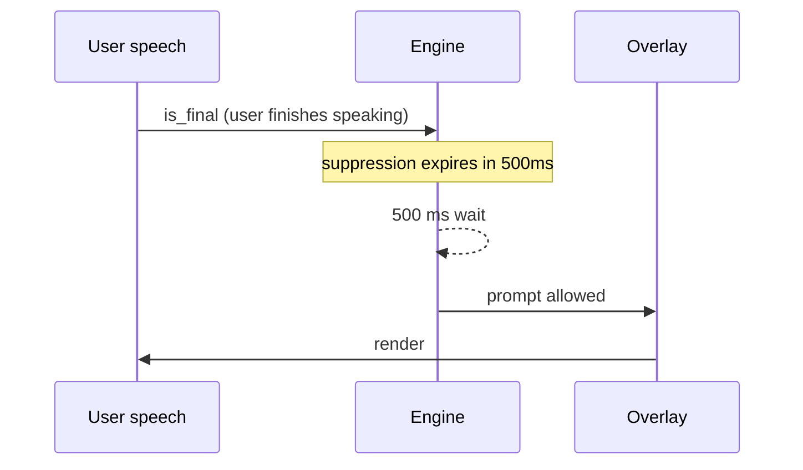

# Cadence Rules

A coach that fires too often is noise; a coach that fires too rarely is useless. Cadence rules encode the firing discipline — when a prompt is *allowed* to appear, even if the engine has one ready.

## Floors by prompt class

| Prompt class | Minimum floor | Evaluated on |
|---|---|---|
| **ELM-triggered** (ego_threat / shortcut / consensus_protection) | **10 s** | counterpart utterances only |
| **General** (Self / Group layers) | **15 s** | both user and counterpart utterances |

General prompts deliberately evaluate on user turns as well. This is what enables **self-coaching** — e.g. *"you've been advocating for 4 minutes, ask a question"* fires during the user's own speech rhythm, not only when the counterpart responds.

ELM prompts are restricted to counterpart turns because the states they detect are defined on counterpart behavior. See [[ELM State Detection]].

## Suppression window

All prompts are suppressed while the user is mid-utterance. A prompt arriving during user speech would be read cognitive-load-wise as *interruption*.

The 500 ms tail after the final `is_final` gives the user a breath before a prompt appears.

## Fallback badge

The real-time coach calls `claude-haiku-4-5` with a **1.5 s timeout**. On timeout:

1. The engine serves a cached fallback from the [[ACE Loop]] bullet store.
2. The overlay renders the fallback with a subtle **`↻ cached`** badge.

The badge is a disclosure requirement — the user must always know whether what they are reading came from the live model or from cache. Fallbacks are not errors; they are a designed degradation path.

## Interaction with priority

Cadence and [[Coaching Layers]] priority interact as follows:

1. Compute candidate prompts for all three layers.
2. Apply cadence floor — drop any layer whose last fire is under its floor.
3. Among survivors, apply priority: **Audience > Self > Group**.
4. Render the winner; track its fire timestamp for the next floor check.

## Why these numbers

- **10 s** for ELM — ego_threat decay window from the pilot transcripts.
- **15 s** for general — conservative; chosen to avoid overwhelming the user rather than maximizing coverage.
- **500 ms** suppression tail — below the perceptual threshold for "interrupted me" in user testing.

All numbers are tunable via settings and are covered by `tests/test_coaching_engine.py`.
