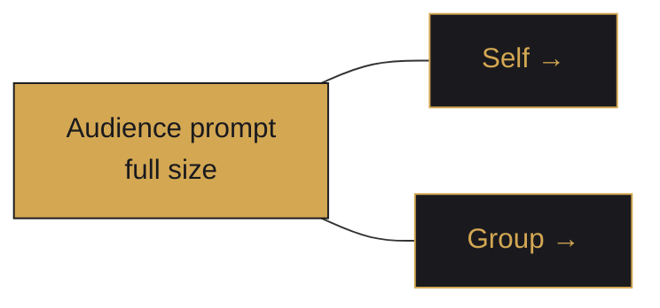

# Coaching Layers

Every coaching opportunity is evaluated through three layers in parallel. The overlay surfaces one at a time, but the engine always has an answer ready for all three.

## The three layers

1. **Self** — *"Are you in the right mode for this moment?"*
   Watches the user's own archetype trajectory, talk-ratio, and stance drift. Example: *"You've been in Advocate mode for 4 minutes — ask a question to re-engage the group."*
2. **Audience** — *"Who is this participant and what do they need?"*
   Conditions on the counterpart's archetype and current [[ELM State Detection]] state. Example: *"Sarah is an Inquisitor — anchor your next point in a number."*
3. **Group** — *"Push, yield, or invite contribution?"*
   Watches group-level dynamics: air-time distribution, silence patterns, coalition formation. Example: *"Two people haven't spoken in 6 minutes — open space."*

## Priority

When multiple layers have a live prompt, the overlay resolves ties by priority:

```
Audience  >  Self  >  Group
```

Audience wins because it is the most concrete and least coachable after the fact. Self is second because it is the only layer the user directly controls in real time. Group is third because it is usually the slowest-moving signal.

## Overlay presentation



The dominant layer renders at full size; the other two collapse to a single-word label with an arrow ("Self →", "Group →"). Tapping a collapsed label swaps it into dominance without breaking the [[Cadence Rules]] floor.

## Why all three fire

A single-layer coach gives brittle advice. Example: an Audience prompt says "ask Sarah a data question," but the user has been dominating — a Self prompt ("yield the floor") is more important. Firing all three and prioritizing lets the engine catch the most coachable surface each tick.

Implementation details live in [[Coaching Engine Architecture]]. Cadence and suppression rules in [[Cadence Rules]].
