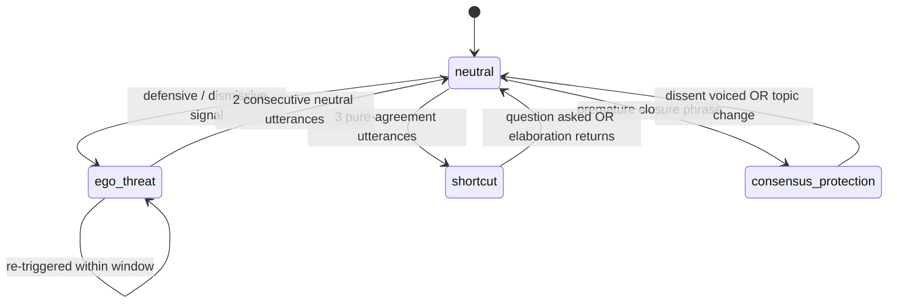

# ELM State Detection

Petty & Cacioppo's **Elaboration Likelihood Model** (1986) distinguishes *central-route* processing (effortful, evidence-sensitive) from *peripheral-route* processing (heuristic, social-cue driven). Persuasion Dojo uses a simplified four-state classifier evaluated on every counterpart turn.

## States and coaching response

| State | Signal | Coaching response |
|---|---|---|
| `ego_threat` | defensive language, dismissive challenges, status claims | acknowledge, back off, ask a question |
| `shortcut` | 3+ consecutive pure-agreement utterances (≤15 words, no questions) | invite pushback, deepen the point |
| `consensus_protection` | premature closure ("we all agree", "let's move on") | explicitly open space for dissent |
| `neutral` | engaged, elaborative discussion | standard Superpower-matched prompts |

ELM-triggered prompts fire on a **10s minimum floor** and are evaluated **only on counterpart utterances** — not user turns. See [[Cadence Rules]].

## State machine

The debounce rule (two consecutive neutrals required to exit `ego_threat`) prevents rapid oscillation when a counterpart softens their phrasing but remains defensive in content.

## Why these four

- `ego_threat` is the highest-cost miss — one wrong prompt can terminate the conversation.
- `shortcut` is the highest-cost false-positive-of-success — the user thinks they are winning when the counterpart has disengaged.
- `consensus_protection` catches premature closure that costs implementation buy-in later.
- `neutral` is the default and covers the majority of runtime.

## Where it's consumed

- [[Coaching Engine Architecture]] reads the current state as a feature when selecting bullets from the [[ACE Loop]] store.
- [[Persuasion Score]] counts `ego_threat` events as the Ego Safety component (30% of score).
- [[Bayesian Knowledge Tracing]] tracks `elm:ego_threat` and `elm:shortcut` as two of its five user skills.

See [[Backend - elm_detector]] for the exact keyword lists, thresholds, and unit tests.
