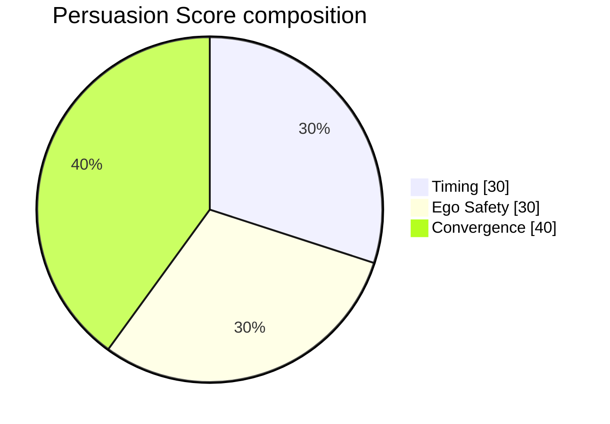

# Persuasion Score

A 0–100 composite computed at session end (and incrementally during the session for the live dial). It is a **heuristic index**, not an empirical measurement — see Disclosure below.

## Weights

## Component definitions

- **Timing (30%)** — talk-time ratio for the user. Peak score in the **25–45%** sweet spot, falling off on either side. Sub-15% or over-60% floors the component at zero.
- **Ego Safety (30%)** — inverse function of `ego_threat` events from [[ELM State Detection]] across the session. Zero events = full 30; score degrades quadratically with event count.
- **Convergence (40%)** — weighted sum of four alignment signals:
  | Signal | Weight |
  |---|---|
  | Linguistic Style Matching (LSM) | 35% |
  | Pronoun convergence (I → we) | 25% |
  | Uptake (building on counterpart's words) | 25% |
  | Question arc (open → closing) | 15% |

## Growth Score

Separate derived metric: **Δ** of the session Persuasion Score vs. a rolling EWMA baseline of the user's prior sessions.

- Returns `None` until the user has **≥ 2 completed sessions** — a single score is not a baseline.
- Used to render the weekly streak widget and the retrospective dashboard.

## Disclosure (required in UI)

> The Persuasion Score is a heuristic index. The 30/30/40 weights are calibrated by user feedback over time, not empirically derived from outcome data. Treat it as a reflection prompt, not a verdict.

This disclosure is a product requirement, enforced in QA — it must render alongside the score in any view that shows the number.

## Relationship to other scores

- [[Flexibility Score and CAPS]] — orthogonal: measures *range* across contexts, not effectiveness within a session.
- [[Bayesian Knowledge Tracing]] — per-skill mastery; Persuasion Score is per-session aggregate.
- [[Backend - signals]] — emits the raw per-turn signals that feed Convergence.

Full implementation and weights live in [[Backend - scoring]].
