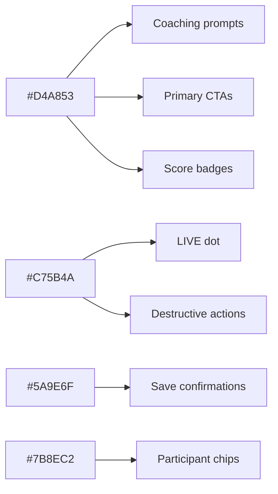

# Colors

Dark-only palette. Every color has a role; accents are scarce on
purpose so they stay meaningful.

## Backgrounds

| Token | Hex | Use |
|---|---|---|
| Primary | `#1A1A1E` | Overlay base, window chrome |
| Card | `#222226` | Prompt cards, list rows |
| Elevated | `#2A2A2F` | Modals, popovers |
| Hover | `#32323A` | Interactive hover state |

## Text

| Token | Hex | Use |
|---|---|---|
| Primary | `#E8E6E1` | Body copy |
| Secondary | `#9A9890` | Labels, metadata |
| Tertiary | `#6A6860` | Disabled, de-emphasized |

## Accents

| Token | Hex | Use |
|---|---|---|
| Gold | `#D4A853` | Coaching intelligence, CTAs, badges |
| Red | `#C75B4A` | LIVE indicator, danger |
| Green | `#5A9E6F` | Success, confirmations |
| Steel blue | `#7B8EC2` | Participant elements **only** |

## Accent assignment

## Forbidden

- `#000000` — pure black. Use `#1A1A1E`.
- `#FFFFFF` — pure white. Use `#E8E6E1`.
- Standard web blues (`#007AFF`, `#1D4ED8`, etc.). Steel blue is the
  only blue, and only for participant UI.

Related: [[Design Overview]], [[Typography]], [[Spacing and Radii]].
