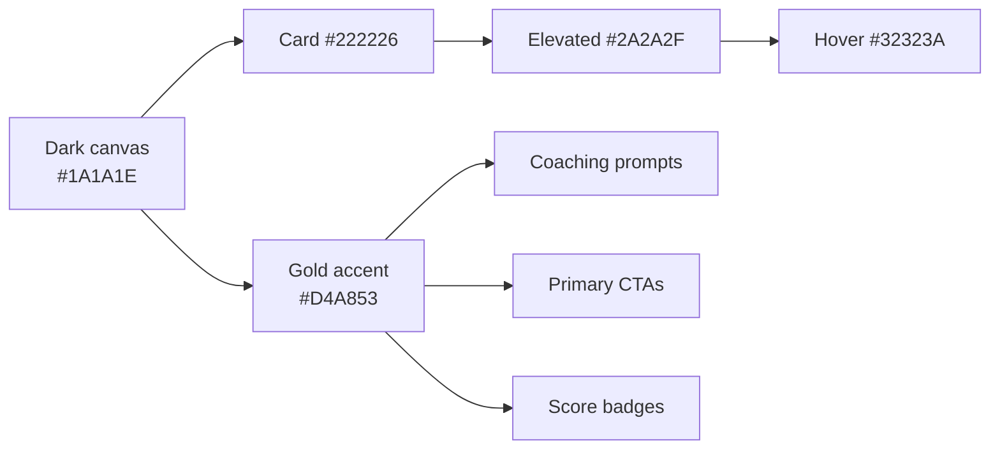

# Design Overview

Persuasion Dojo is a **floating, always-on-top overlay** that sits beside
Zoom / Meet / Teams. Its visual language is dark, minimal, and
gold-accented — designed to feel like a private coach whispering in the
user's ear rather than a desktop app demanding attention.

`DESIGN.md` at the repo root is the **source of truth**. Everything in
this vault summarizes it; if the two ever disagree, `DESIGN.md` wins.

## Principles

- **Quiet by default.** The overlay is small, dim, and non-modal. It only
  raises its voice when coaching fires.
- **One thing at a time.** A single coaching prompt dominates the frame;
  secondary content recedes.
- **Gold means intelligence.** `#D4A853` is reserved for coaching,
  scores, and primary CTAs — the things the user should trust.
- **Never pure black, never pure white.** Pure values feel cheap and
  fatigue the eye during long meetings.

## Aesthetic map

## QA-enforced rules

- Background must be `#1A1A1E` — **never** `#000000`.
- Typography: [[Typography|Playfair Display + DM Sans + JetBrains Mono]]
  only. No Inter / Roboto / Arial / Helvetica / Geist / Instrument Serif.
- Gold `#D4A853` is the single accent for coaching intelligence and
  primary CTAs — don't use it for decoration.
- See [[Colors]] for the full palette, [[Spacing and Radii]] for layout
  constants, and [[First-Run Wizard]] for the onboarding emotional arc.
