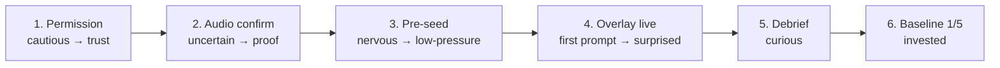

# First-Run Wizard

First-run is the emotional contract: we ask for Screen Recording
permission, a scary request, and earn trust fast. Every step maps to a
feeling and a deliverable.

## Emotional arc

## Steps

1. **Permission.** Request Screen Recording. Copy: *"We never store
   audio — only your patterns."* Honest, specific, one sentence.
2. **Audio confirm.** Live audio-level meter plus a test tone so the
   user sees the pipeline working. Moves them from *"did that work?"* to
   *"yes, I can see it."*
3. **Pre-seed (optional).** Paste LinkedIn URLs, emails, or free-text
   bios for upcoming participants. Optional and low-pressure — skippable
   without guilt.
4. **Overlay appears minimized.** First prompt fires after roughly 60
   seconds. Only the **dominant layer** is shown (single clear prompt,
   not all three at once). See [[Coaching Layers]].
5. **Debrief loads** with progressive reveal: stats → score → replay.
   600ms reveal (see [[Spacing and Radii]]).
6. **"Building your baseline — 1 of 5 sessions"** framing. The user is
   now invested in completing the five-session baseline.

## Permission denial flow

If macOS Screen Recording is denied, the overlay shows:

> System Settings → Privacy & Security → Screen Recording → Enable
> Persuasion Dojo → Relaunch.

Deep-link to the Privacy pane where possible; otherwise show the
path plainly.

Related: [[Design Overview]], [[Coaching Layers]].
