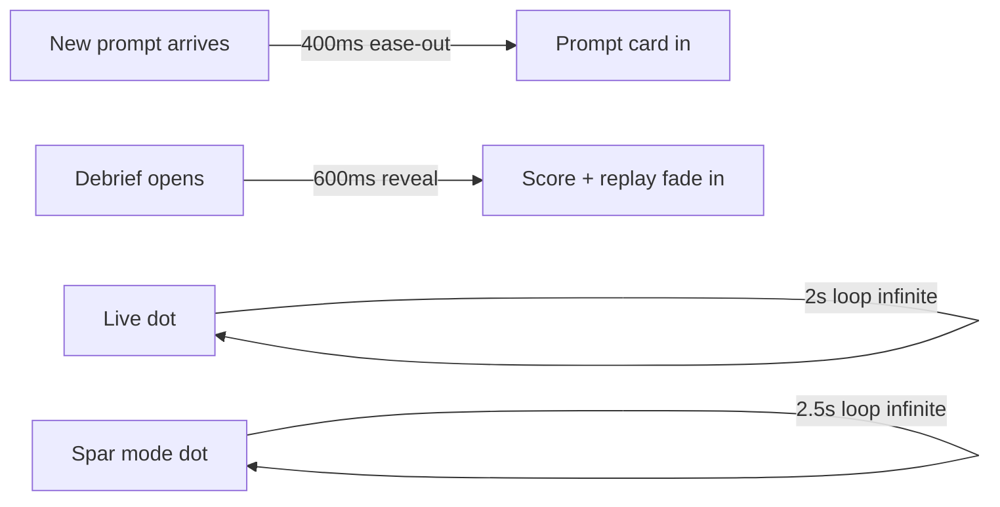

# Spacing and Radii

Layout constants that keep the overlay feeling consistent across
panes. Deviating is a visible regression.

## Border radius

| Radius | Use |
|---|---|
| 8px | Small chips, tags |
| 10px | Ghost buttons, inputs |
| 12px | Primary buttons, coaching prompts |
| 20px | Pills, participant badges |

## Button heights

| Height | Role |
|---|---|
| 54px | Primary CTA (onboarding, session start) |
| 50px | Secondary action |
| 42px | Ghost / tertiary |

## Content padding

- Horizontal: **28px** at the frame edge
- Vertical: **22px** top / **24px** bottom for the prompt card
- Tight clusters: **8px** inside chip groups

## Gaps

| Gap | Use |
|---|---|
| 8px | Tight (chip group, icon + label) |
| 10px | Between sibling buttons |
| 12px | Between logical sections |

## Motion

- Prompt entrance: **400ms ease-out**
- Debrief reveal: **600ms** progressive reveal
- LIVE dot pulse: **2s** infinite
- Sparring mode pulse: **2.5s** infinite

Related: [[Design Overview]], [[Typography]], [[Colors]].
