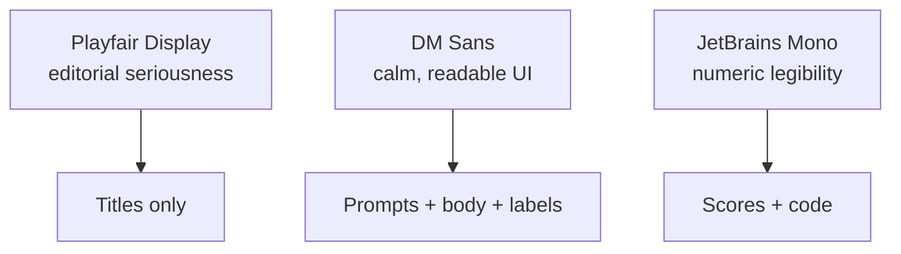

# Typography

Three fonts — no substitutions. Each has a specific job and a specific
color. Mixing them is what gives the overlay its quiet-but-editorial
voice.

## Roles

| Role | Font | Weight | Size | Color |
|---|---|---|---|---|
| App title | Playfair Display | 600 | 32px | `#D4A853` |
| Coaching prompt | DM Sans | 500 | 17px | `#D4A853` |
| Body | DM Sans | 400 | 14px | `#E8E6E1` |
| Labels | DM Sans | 400 | 13px | `#9A9890` |
| Code / scores | JetBrains Mono | 400 | 13px | `#9A9890` |

## Why these three

- **Playfair Display** — serif, editorial; signals that the tool takes
  the user's communication seriously. Titles only.
- **DM Sans** — humanist sans; carries the bulk of the UI and coaching
  prompts without feeling generic.
- **JetBrains Mono** — monospace; used where numbers must align
  (Persuasion Score, timestamps, debug overlays).

## Never use

Inter, Roboto, Arial, Helvetica, Geist, Instrument Serif. These are
either overused (Inter/Roboto), system-default (Arial/Helvetica), or
visually close enough to our choices to cause drift (Geist /
Instrument Serif). QA will flag any of them.

Related: [[Design Overview]], [[Colors]], [[Spacing and Radii]].
