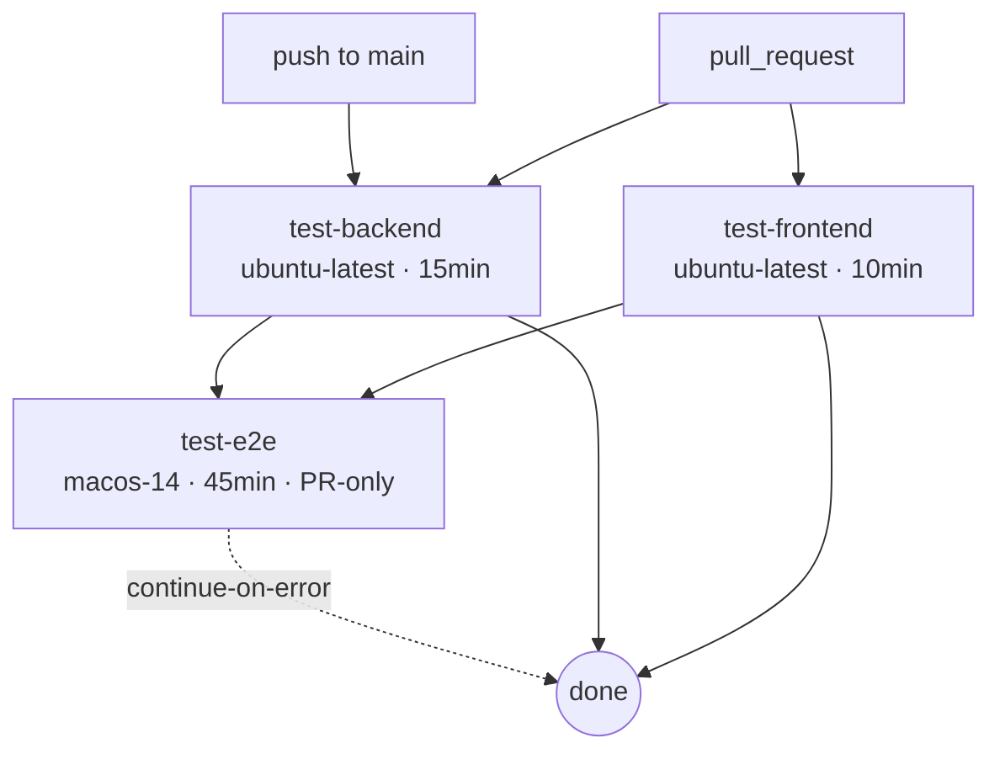

# CI Pipeline

Config: `.github/workflows/ci.yml`.

## Triggers

- `push` to `main`
- `pull_request` (any branch)

Both triggers **ignore** paths that don't affect behavior:
`**/*.md`, `docs/**`, `DESIGN.md`, `TODOS.md`, `.gstack/**`.

Concurrency cancels in-progress runs for the same branch / PR so only
the latest commit is tested.

## Jobs



### 1. test-backend

- Runner: `ubuntu-latest`, timeout **15 min**
- Python **3.12** with pip cache
- Installs `requirements.txt` + `requirements-dev.txt` +
  `requirements-voiceprint.txt`
- Run:
  ```bash
  pytest -m "not integration and not eval" \
    --ignore=tests/test_pipeline_e2e.py \
    --timeout=30 \
    --cov=backend --cov-fail-under=75
  ```

### 2. test-frontend

- Runner: `ubuntu-latest`, timeout **10 min**
- Node **20**, `npm ci`
- Run: `npx vitest run`

### 3. test-e2e

- Runner: `macos-14`, timeout **45 min**
- `needs: [test-backend, test-frontend]`
- **PR-only** (skipped on push to `main` to conserve macOS minutes)
- `continue-on-error: true` so a flaky E2E doesn't red-bar the PR
- Steps: `npm ci` → `npm run build` (unpacked) →
  `playwright install` → `playwright test` → upload HTML report on
  failure

## Why this shape

- Linux for Python + Vitest keeps the fast path cheap.
- macOS only runs when the cost is justified (a PR that already passed
  the two fast jobs).
- Docs-only changes don't burn CI minutes.

Related: [[Python Tests]], [[Frontend Tests]], [[Release Pipeline]].
