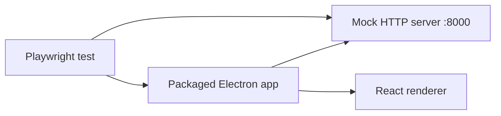

# Frontend Tests

Two layers: **Vitest** for unit/component tests and **Playwright for
Electron** for full E2E flows.

## Vitest unit tests

Environment: `jsdom`. Setup file: `tests/setup.ts`.

| File | What it covers |
|---|---|
| `capture-env.test.ts` | Port resolution fallback (`AUDIO_BACKEND_PORT`, empty-string env handling) |
| `components.test.tsx` | HistoryTray, ConnectionStatus, RetroImportPane, Overlay integration |
| `sentry.test.ts` | Sentry init (DSN presence, env tagging) |

Commands:

```bash
npm run test         # run once
npm run test:watch   # watch mode
```

## Playwright for Electron (E2E)

Located in `tests/e2e/`. Each file drives the packaged Electron app
end-to-end against a mock HTTP server bound to `:8000`.

Covered flows: onboarding, navigation, session, self-assessment,
preseed, calendar, team-sync, settings, sparring, retro-import.

Config highlights:

- `workers: 1` — tests run serially (single shared mock server)
- `timeout: 30s`
- `retries: 2` in CI, `0` locally
- Mock HTTP server is spun up per test file



Commands:

```bash
npm run test:e2e                 # full E2E
npx playwright test --headed     # watch it run
npx playwright test --debug      # step through with inspector
```

## What each layer owns

- **Vitest** — pure logic, component rendering, env parsing, Sentry
  wiring. Fast, runs on every PR.
- **Playwright** — "does the app actually work when packaged?" Slow,
  macOS-only (see [[CI Pipeline]]), PR-triggered only.

Related: [[Python Tests]], [[CI Pipeline]], [[React Renderer]],
[[Electron Main Process]].
