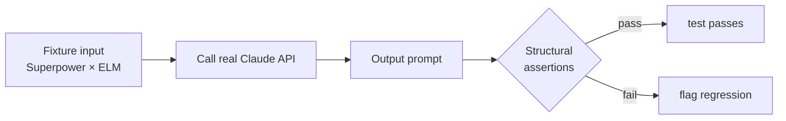

# LLM Evals

Located in `tests/evals/`. These tests make **real, paid** Claude API
calls. They are **not** run by default; CI excludes them via
`-m "not eval"`. Run locally when you want to gate coaching quality.

## How an eval works



Each eval:

1. Uses a fixture that encodes *input conditions* (e.g. Architect + ego
   threat state).
2. Calls the function under test, which hits the live Claude API.
3. Asserts on **structural properties** — never on exact text.
   Examples: word count ≤ 18, no preamble ("Here's a tip:"), positive
   framing, correct `layer` / `trigger` / `speaker_id` on the returned
   metadata.
4. Skips gracefully if `ANTHROPIC_API_KEY` is unset.

## Current evals

| File | Purpose |
|---|---|
| `coaching_prompts.py` | 10 fixtures covering the Superpower × ELM matrix. Asserts ≤18 words, no preamble, positive framing, correct layer / trigger / speaker_id. |
| `pre_seeding.py` | 6 automated fixtures. Pass criterion: **≥70% correctly classified**. Real-world gate is a separate human-in-the-loop script (see below). |
| `prompt_quality_grader.py` | Shared grading utilities used by both evals. |

The real-world pre-seed gate (~2 hours of human effort) lives in
`scripts/real_world_gate.py` — it's intentionally not automated because
ground-truth classification requires a human.

## Adding a new eval

1. Create `tests/evals/<module>.py`.
2. Decorate the test with `@pytest.mark.eval`.
3. Add `@pytest.mark.skipif(os.getenv("ANTHROPIC_API_KEY") is None, ...)`
   so the test skips instead of failing on unconfigured envs.
4. Call the real function (no mocks here — the whole point is live API).
5. Assert on **properties**, not exact strings. Coaching text is
   non-deterministic; structure is not.

## Commands

```bash
pytest -m eval                               # all evals
pytest tests/evals/coaching_prompts.py -v    # just coaching
```

Related: [[Python Tests]], [[Coaching Engine Architecture]], [[CI Pipeline]].
