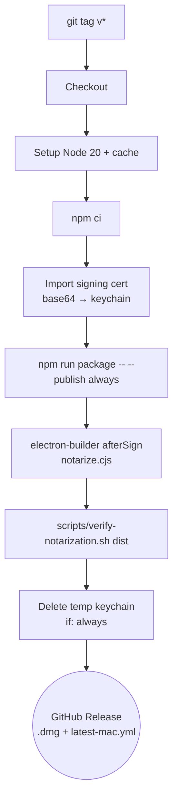

# Release Pipeline

Config: `.github/workflows/release.yml`.

**Trigger:** push of a tag matching `v*` (e.g. `v1.4.0`).

Single job: `release-mac` on `macos-14`, timeout **60 min**. Working
directory is `frontend/overlay`.

## Flow

## Steps in detail

1. **Checkout** → **Node 20** with cache → `npm ci`.
2. **Import signing certificate.** Base64-decode `CSC_LINK` into a
   temporary keychain, import the `.p12` using `CSC_KEY_PASSWORD`.
3. **Build & package.** `npm run package -- --publish always`.
   `electron-builder` invokes `notarize.cjs` via `afterSign`. Injects
   `SENTRY_DSN` and `SENTRY_AUTH_TOKEN` for source-map uploads.
   `--publish always` uploads artifacts to the GitHub Release for the
   current tag.
4. **Verify notarization.** `scripts/verify-notarization.sh dist`
   checks **both** the `.dmg` and the electron-updater payload
   referenced in `latest-mac.yml`. Either failing fails the job.
5. **Cleanup keychain.** Runs with `if: always()` so secrets are never
   left on the runner, even if an earlier step failed.

## Required secrets

| Secret | Purpose |
|---|---|
| `CSC_LINK` | Base64-encoded Developer ID `.p12` |
| `CSC_KEY_PASSWORD` | Password for the `.p12` |
| `APPLE_ID` | Apple ID used for notarization |
| `APPLE_APP_SPECIFIC_PASSWORD` | App-specific password for notarization |
| `APPLE_TEAM_ID` | Team ID for notarization |
| `GITHUB_TOKEN` | Publish release artifacts |
| `SENTRY_DSN` | Runtime error reporting |
| `SENTRY_AUTH_TOKEN` | Upload source maps |
| `SENTRY_ORG` | Sentry organization slug |
| `SENTRY_PROJECT` | Sentry project slug |

## Failure modes

- **Notarization times out.** Apple's notary service is occasionally
  slow; re-run the job. If persistent, check `APPLE_ID` /
  `APPLE_APP_SPECIFIC_PASSWORD` have not expired.
- **`verify-notarization.sh` fails on the updater payload.** The `.dmg`
  can notarize while the ZIP referenced by `latest-mac.yml` does not —
  always verify both, which the script does.
- **Keychain left behind.** The `if: always()` cleanup step guards
  against this; if you add steps, keep that guard.

Related: [[CI Pipeline]], [[Build and Package]].
