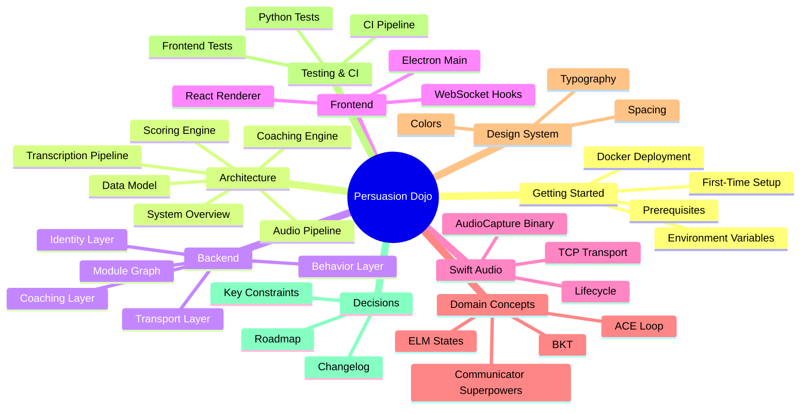
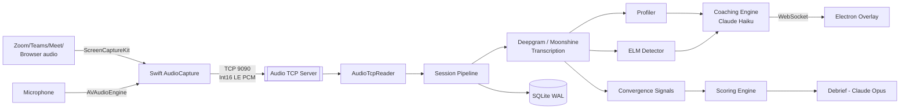

# Persuasion Dojo — Developer Vault

> **A live conversation coaching app that listens to a meeting in real time, transcribes it, and surfaces private coaching prompts based on the [[Communicator Superpowers]] framework.**

This vault is an [Obsidian](https://obsidian.md) knowledge base for the Persuasion Dojo codebase. Every note is authored with YAML frontmatter, cross-links via `[[wikilinks]]`, and mermaid diagrams so that **Obsidian's Graph view** renders a living picture of the system.

---

## How to use this vault

1. **Open it in [Obsidian](https://obsidian.md)** — point the vault at `docs/vault/`.
2. **Open Graph view** (`⌘G` on macOS) — you'll see every module and concept connected by its imports and references.
3. **Follow the links.** Most explanations live one hop away.
4. **Start with the section that matches what you need** — see the map below.

For vault conventions (frontmatter schema, tag taxonomy, how to add a note), see [[Vault Guide]].

---

## Map of content

---

## Quick index

### 🚀 Getting started
- [[Prerequisites]]
- [[Environment Variables]]
- [[First-Time Setup]]
- [[Running the Backend]]
- [[Running the Frontend Overlay]]
- [[Running the Swift Binary]]
- [[Docker Deployment]]
- [[Troubleshooting]]

### 🏛 Architecture
- [[System Overview]]
- [[Audio Pipeline]]
- [[Transcription Pipeline]]
- [[Coaching Engine Architecture]]
- [[Scoring Engine]]
- [[Data Model]]

### 🐍 Backend (Python)
- [[Backend Module Graph]] ← start here, includes full mermaid dependency graph
- [[Backend - Transport Layer]]
- [[Backend - Identity Layer]]
- [[Backend - Behavior Layer]]
- [[Backend - Coaching Layer]]
- [[Backend - Orchestration Layer]]

### ⚛ Frontend (Electron + React)
- [[Frontend Overview]]
- [[Electron Main Process]]
- [[React Renderer]]
- [[WebSocket Hooks]]
- [[Build and Package]]

### 🎙 Swift audio
- [[AudioCapture Binary]]
- [[TCP Transport]]
- [[Audio Lifecycle and Supervision]]

### 🧠 Domain concepts
- [[Communicator Superpowers]]
- [[Coaching Layers]]
- [[ELM State Detection]]
- [[Persuasion Score]]
- [[Flexibility Score and CAPS]]
- [[ACE Loop]]
- [[Bayesian Knowledge Tracing]]
- [[Cadence Rules]]

### 🎨 Design system
- [[Design Overview]]
- [[Typography]]
- [[Colors]]
- [[Spacing and Radii]]

### ✅ Testing & CI
- [[Python Tests]]
- [[LLM Evals]]
- [[Frontend Tests]]
- [[CI Pipeline]]
- [[Release Pipeline]]

### 📜 Decisions & roadmap
- [[Key Constraints and Decisions]]
- [[Changelog Highlights]]
- [[Roadmap and TODOs]]
- [[Design Docs Index]]

---

## One-page architecture

See [[System Overview]] for the full walk-through.

---

## External references

- [Obsidian](https://obsidian.md) — the app this vault is built for
- [ARCHITECTURE.md](../../ARCHITECTURE.md) — the repo's canonical architecture reference (distilled into this vault)
- [DESIGN.md](../../DESIGN.md) — full design-system spec
- [CLAUDE.md](../../CLAUDE.md) — project instructions for AI agents
- [README.md](../../README.md) — project README

> _Last rebuilt: 2026-04-19. Regenerated whenever `backend/`, `frontend/overlay/`, `swift/`, `docs/`, or the top-level design docs change materially._
